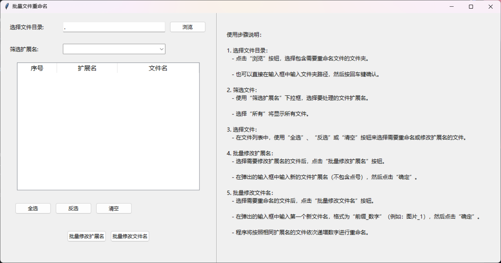

# 批量文件重命名工具 

## 🌟 项目简介
在日常的文件管理工作中，批量修改文件名和扩展名是一项常见却繁琐的任务。本工具旨在简化这一过程，为用户提供高效、便捷的批量文件重命名解决方案，节省宝贵时间，提升工作效率。

## 📥 下载与安装
### 可执行文件（推荐）
- 直接从项目发布页面下载最新版本的`batch-rename.exe`。
- 下载完成后，双击该文件即可运行，无需额外安装Python环境。

### Python源文件
- 如果你对代码感兴趣，或者想根据自己的需求进行定制，可从项目仓库下载`batch-rename.py`源文件。
- 运行源文件前，请确保你已安装Python 3.12或更高版本。安装好Python后，通过命令行进入存放`batch-rename.py`的目录，执行`python batch-rename.py`即可启动程序。

## 🛠 使用指南

### 选择文件目录 📂
1. 点击界面上的“浏览”按钮，在弹出的文件选择对话框中，定位到包含需要修改文件的文件夹。
2. 也可以在输入框中手动输入文件夹路径，然后按回车键确认。

### 筛选文件 🔍
1. 使用“筛选扩展名”下拉框，选择特定扩展名的文件进行操作。例如，你可以选择`.txt`文件，仅对文本文件进行处理。
2. 若选择“所有”，则会显示该目录下的所有文件和文件夹。

### 选择要操作的文件 📃
1. 在文件列表中，通过鼠标点击进行单个选择，或者使用“全选”“反选”“清空”按钮来快速选择需要修改扩展名或文件名的文件。

### 批量修改扩展名 🔄
1. 选择好要修改扩展名的文件后，点击“批量修改扩展名”按钮。
2. 在弹出的输入框中输入新的文件扩展名（不包含点号）。例如，若要将文件改为图片格式，可输入`jpg`。
3. 点击“确定”，程序将自动批量修改所选文件的扩展名。

### 批量修改文件名 📝
1. 选择需要重命名的文件后，点击“批量修改文件名”按钮。
2. 在弹出的输入框中输入第一个新文件名，格式为“前缀_数字” ，如“图片_1”。
3. 程序将按照所选文件的相同扩展名，依次递增数字进行重命名。例如，若选择了三个`.png`文件，最终文件名可能为“图片_1.png”“图片_2.png”“图片_3.png” 。

## 📋 注意事项
1. **文件夹操作**：修改扩展名功能无法对文件夹进行操作，若选择了文件夹，会提示错误。请确保仅选择需要修改扩展名的文件。
2. **文件名格式**：批量修改文件名时，请严格按照“前缀_数字”的格式输入，否则会提示格式错误。例如，“文档_1”是正确格式，“文档1”则不符合要求。
3. **文件冲突**：重命名过程中，若目标文件名已存在，可能导致重命名失败。请提前确认文件名的唯一性，避免覆盖重要文件。
